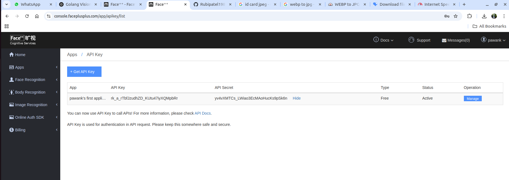

# golang-fifth
Vision API For Face deduction

## Execute below commond
    go mod init visionApi
    go get -u github.com/otiai10/gosseract/v2
    go get -u gocv.io/x/gocv

    go mod tidy
    go run main.go
    
## [In Ubuntu main]
    sudo apt update
    sudo apt install tesseract-ocr 
    sudo apt install -y libopencv-dev pkg-config
    sudo apt install -y tesseract-ocr libtesseract-dev libleptonica-dev

## Face++ Website For key
Username - pawank
Password - Bsa@123456
